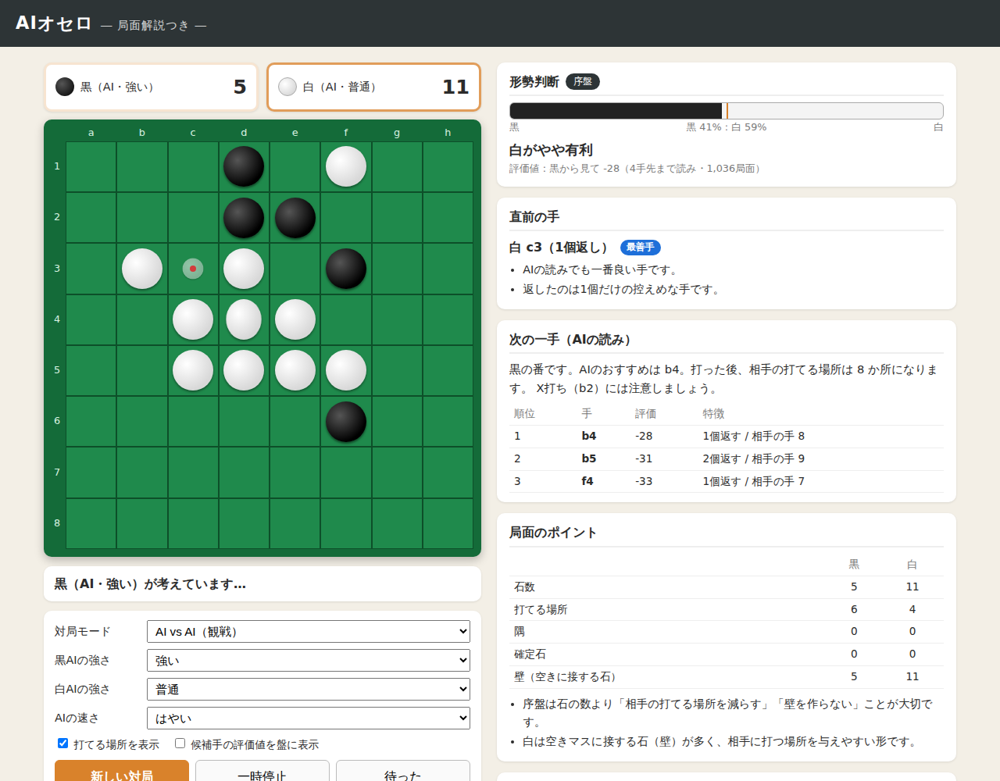
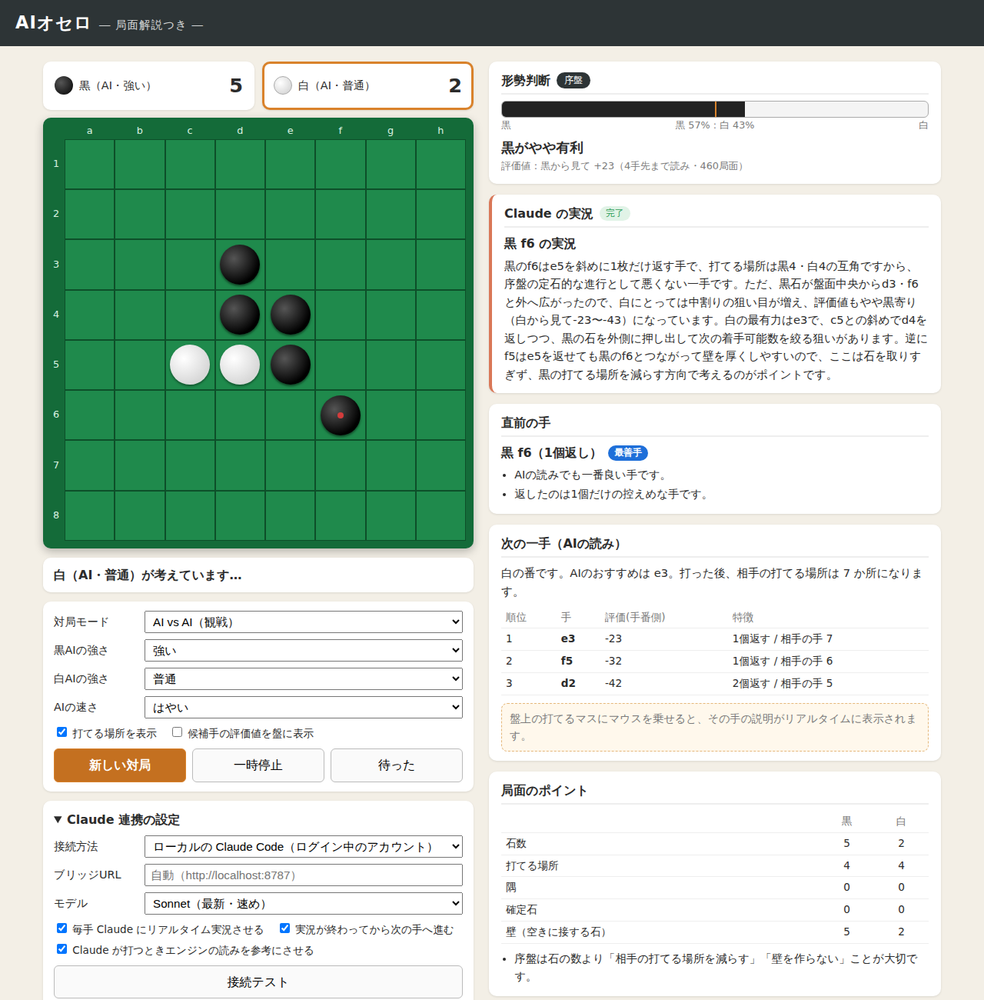

# AIオセロ ― 局面解説つき

HTML / CSS / JavaScript だけで動くオセロです。AIが対局し、1手ごとに **局面の説明（解説）** を表示します。



## AlphaZero

人間の知識を使わず、**ルールだけから自己対局 20,160局で学習した AlphaZero** が入っています（CPU 4コアで約3.5時間）。
完成版は内蔵の αβ 探索AI「普通」「強い」「最強」に **120戦全勝**。十分に強くなった完成版同士の対戦は接戦や引き分けが多くなりました。
詳しい数値・対戦結果・再現手順は [docs/alphazero.md](docs/alphazero.md) を見てください。

- 盤の右側「AlphaZero の読み」に、勝率・候補手の探索配分・ネットの直感・読み筋が探索中もリアルタイムで表示されます
- 「AlphaZero（学習途中）」（反復10）と戦わせると、学習による成長がわかります
- 「対局の再生」で、完成版同士の20局を実況つきで見られます

## ブラウザで遊ぶ

- **公開ページ（GitHub Pages）**: https://ryo-tanohata.github.io/OseroExp/
  （リポジトリの Settings → Pages で公開を有効にすると見られます）
- **自分のパソコンで**: リポジトリを ZIP でダウンロードして `index.html` をダブルクリック（ネット接続も不要）

**AIと対戦する**: ページを開くとすぐに、あなた（黒・先手）対 AlphaZero の対局が始まります。光っているマスをクリック（スマホはタップ）して打ちます。
盤の上の「対戦相手」で相手（AlphaZero／最強／強い／普通／弱い）を選び、「黒（先手）で対戦」「白（後手）で対戦」で始め直せます。「待った」で1手戻せます。
AlphaZero 同士を観戦する: 「AI vs AI（観戦）」で黒・白とも AlphaZero を選びます。
実況は既定で **「内蔵の実況」**（言語モデルなし・無料・インストール不要）が1文字ずつリアルタイムに流れます。**Ollama や Qwen は不要**です。
Claude や Ollama の言語モデルで実況させたい場合だけ、自分のパソコンで `node server/claude-bridge.mjs` を起動して使います（任意）。
無料のローカルモデル（Ollama など）の使い方と規約上の注意は [docs/llm.md](docs/llm.md) にまとめています。

## 遊び方

ビルドやサーバーは不要です。`index.html` をブラウザで開くだけで動きます。
（GitHub Pages で公開する場合も、リポジトリのルートをそのまま公開すればOKです）

### 対局モード
| モード | 内容 |
| --- | --- |
| あなた(黒) vs AI(白) | 先手でAIと対局 |
| AI(黒) vs あなた(白) | 後手でAIと対局 |
| AI vs AI（観戦） | AI同士の対局を解説付きで観戦（初期設定） |
| 人 vs 人 | 2人で対局（解説・AIの読みは表示される） |

- **AIの強さ**：弱い / 普通 / 強い / 最強 を黒・白それぞれに設定できます
- **待った**：自分の直前の手番まで戻します
- **一時停止**：AI同士の対局を止めて、局面をじっくり確認できます
- **候補手の評価値を盤に表示**：AIが読んだ各マスの評価値を盤上に表示します

## Claude と連携する（Claude が打つ・リアルタイム実況）

黒AI／白AIの強さで **「Claude」** を選ぶと Claude が手を選び、その考えがリアルタイムで表示されます。
「毎手 Claude にリアルタイム実況させる」をオンにすると、誰が打った手でも Claude がストリーミングで実況します。



パソコンの `claude` コマンド（Claude Code）にログインしているアカウントで動きます。
**APIキーは使わないので、APIの従量課金はかかりません**（アカウントの利用枠の中で動きます）。

```bash
# 事前に Claude Code をインストールして `claude` で一度ログインしておく
node server/claude-bridge.mjs
# → ブラウザで http://localhost:8787 を開き、「Claude 連携の設定」で「ローカルの Claude Code」を選ぶ
```

- `server/claude-bridge.mjs` は依存パッケージなし（Node.js 18 以上）の小さなサーバーです
- 受け取った依頼を `claude -p` に渡し、返ってくる文章をそのままブラウザへ流します（ツールは無効化）
- 環境変数 `ANTHROPIC_API_KEY` などが設定されていても `claude` には渡さず、必ずログイン中のアカウントで動かします
- `127.0.0.1` だけで待ち受け、他のサイトからは呼べないようにしています
- Claude を使わない場合は、`index.html` を開くだけで内蔵AIと解説がすべて動きます

### 安全性について

- **公開ページ（GitHub Pages）からは Claude も Ollama も使えません。** 公開ページはただの静的ファイルで、動くのは AlphaZero・内蔵AI・内蔵の実況だけです（すべてブラウザの中で完結し、どこにも通信しません）
- リポジトリに APIキーやパスワードなどの秘密情報は含まれていません。`claude` のログイン情報はパソコンの中にあり、ブリッジはそれを読んだり外に送ったりしません
- ブリッジ（`server/claude-bridge.mjs`）は、それを**自分で起動した人のパソコンの中だけ**で動きます。他の人がリポジトリを使っても、その人自身のアカウントで動き、あなたのアカウントには届きません
- ブリッジの守り
  - `127.0.0.1` でだけ待ち受ける（ネットワークの他のパソコンからは届かない）
  - `http://localhost:8787` 自身のページからの依頼だけを受け付ける（他のサイト・`file://`・サンドボックス化された iframe からの依頼は拒否）
  - Host ヘッダーも確認し、DNS リバインディング攻撃を防ぐ
  - `claude` はツールを無効にして起動する（ファイルの読み書きやコマンド実行はできない）
  - 環境変数の APIキーは `claude` に渡さない（従量課金にならない）
  - Ollama などへの中継先はこのパソコン上のサーバーだけに限定する
- Claude・Ollama の実況を使うときは、ブリッジを起動して **http://localhost:8787** で開いてください。使い終わったらターミナルで Ctrl+C を押してブリッジを止めれば、外からは一切使えなくなります

## 局面の説明（解説）の内容

- **リアルタイムの手の説明**：盤上の打てるマス（または候補手の行）にマウスを乗せると、「もしここに打つと…」の評価・特徴がすぐに表示されます
- **Claude の実況**：Claude の文章は生成されたそばから少しずつ表示されます

| パネル | 内容 |
| --- | --- |
| 形勢判断 | 評価値と勝率の目安をバーで表示。「互角」「黒がやや有利」など。終盤は完全読みで勝敗と石差を表示 |
| 直前の手 | 最善手 / 好手 / 緩手 / 疑問手 / 悪手 の判定と、隅・X打ち・C打ち・中割り・相手の着手可能数の変化・隅を与えたか などの説明 |
| 次の一手 | AIのおすすめの手と、上位3つの候補手の評価・特徴 |
| 局面のポイント | 石数・打てる場所・隅・確定石・壁（空きマスに接する石）の比較と、そこから読み取れるポイント |
| 棋譜 | これまでの手と、その手の評価 |

## AIのしくみ

- **探索**：αβ法（negamax）。ルートでは全候補手の評価値を正確に求め、解説に利用しています
- **評価関数**：マスの重み（隅は高く、X/Cマスは低い。隅が埋まれば減点を解除）＋着手可能数＋終盤の石数
- **終盤の完全読み**：残りマスが少なくなると最後まで読み切って勝敗を判定します

| 強さ | 読みの深さ | 完全読み | 備考 |
| --- | --- | --- | --- |
| 弱い | 1手 | なし | 評価にランダムなノイズ |
| 普通 | 2手 | 残り8マス | 少しノイズ |
| 強い | 4手 | 残り10マス | 解説用の読みと同じ設定 |
| 最強 | 6手 | 残り12マス | 1手に数秒かかることがあります |

## ファイル構成

```
index.html        画面
css/style.css     デザイン
js/game.js        ルール（合法手・石を返す・確定石など）
js/ai.js          AI（評価関数・αβ探索・完全読み）
js/explain.js     局面の解説文の生成
js/main.js        画面の描画と対局の進行
js/claude.js      言語モデル連携（プロンプト作成・ストリーミング表示・着手の読み取り）
js/prompts.js     実況用の知識メモとお手本（書き換え可）
js/alphazero.js   AlphaZero の推論と探索（ブラウザ用）
models/           学習済みの重み・完成版同士の対局記録
train/            AlphaZero の学習・評価（Python + PyTorch）
docs/alphazero.md 学習と対戦の記録
docs/llm.md       実況用の言語モデル（無料・規約の注意）
server/claude-bridge.mjs  ローカルの Claude Code とつなぐサーバー
tests/run-tests.js  ルール・AI・解説のテスト
```

## テスト

Node.js があれば次のコマンドでテストできます。

```
node tests/run-tests.js
```
